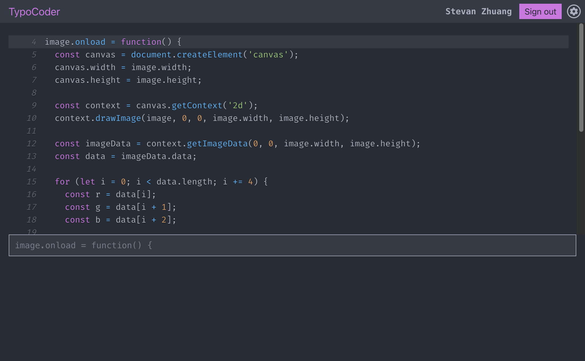

# TypoCoder

TypoCoder is a typing game for developers. It helps improve your typing speed while also helping you get familiar with various programming languages. It is a full-stack application that uses React for the frontend, Node.js for the backend, and MongoDB for the database. It uses OpenAI's GPT-3 model to generate code snippets.

## Installation

Clone the repository:

```bash
git clone https://github.com/Stevan-Zhuang/typocoder.git
```

Navigate to the project directory:

```bash
cd typocoder
```

Install the dependencies:

```bash
npm install
cd ./server && npm install
cd ../client && npm install
```

## Usage

Start the application:

```bash
npm start
```

Open your web browser and visit `http://localhost:3000`.

## Features

- User authentication
- Tracks typing statistics over time
- Customizable settings
- Supports multiple programming languages

## Preview



## Contributing

Pull requests are welcome. For major changes, please open an issue first to discuss what you would like to change.
